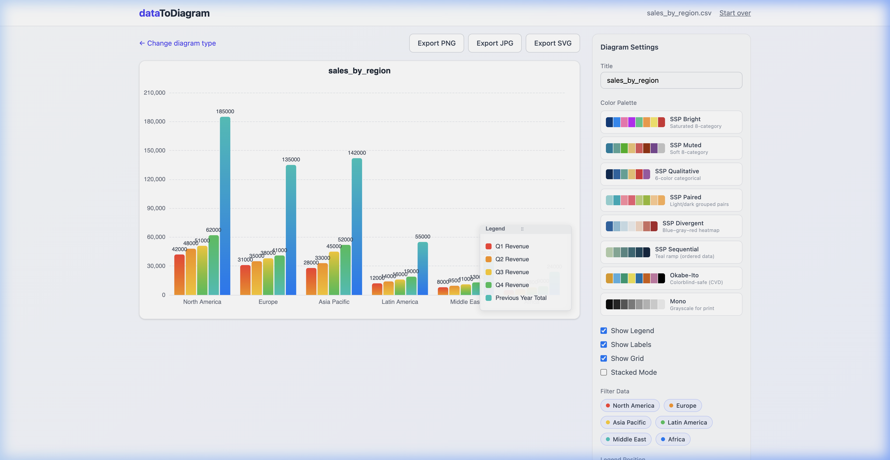
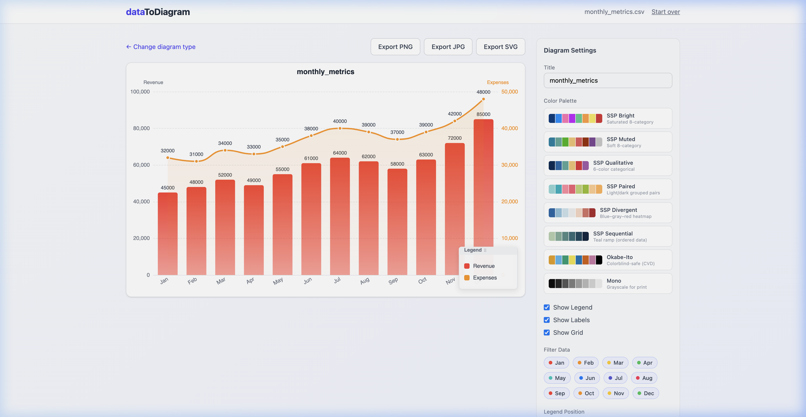
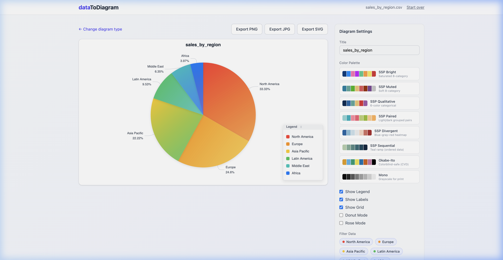
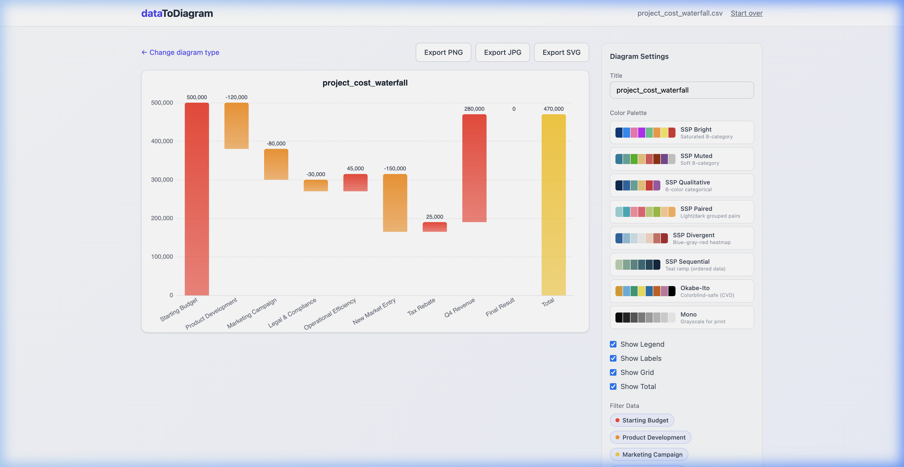
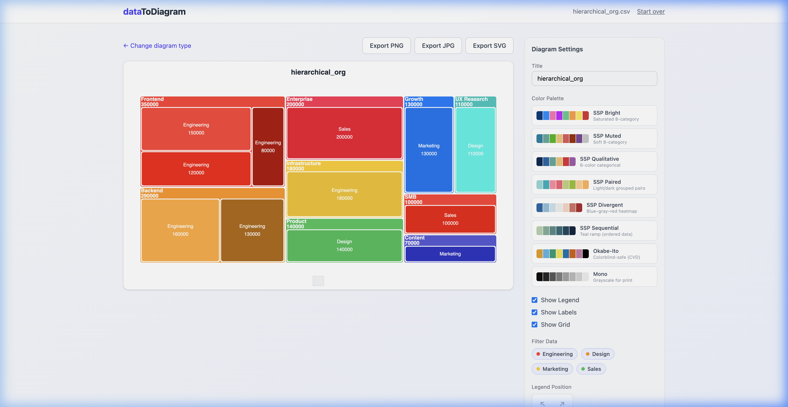
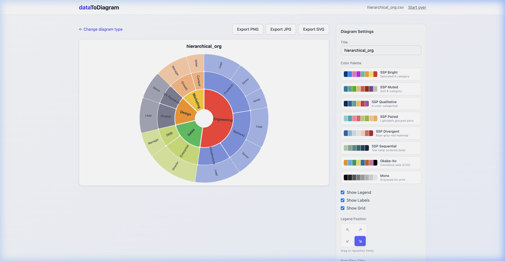
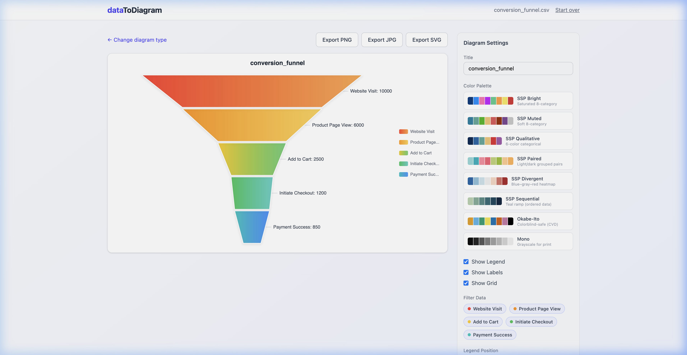

# dataToDiagram

**Transform your data into beautiful visuals instantly.**
dataToDiagram is a minimalist, high-performance tool built to turn your CSV and Excel files into professional, interactive diagrams. Whether you need a simple bar chart or a complex sunburst, we've got you covered.

## Getting Started

Follow these simple steps to run dataToDiagram on your local machine:

1.  **Clone the repository**:
    ```bash
    git clone https://github.com/your-repo/dataToDiagram.git
    cd dataToDiagram
    ```
2.  **Install dependencies**:
    ```bash
    npm install
    ```
3.  **Launch the application**:
    ```bash
    npm run dev
    ```
4.  **Open in your browser**: Navigate to `http://localhost:5173/` (or the port shown in your terminal).

---

## Chart Gallery

Explore the wide range of visual styles supported by dataToDiagram. Each chart is designed to be clean, responsive, and highly customizable.

| Chart Type | Best For... | Preview |
| :--- | :--- | :--- |
| **Bar Chart** | Comparing categories and tracking totals. |  |
| **Line & Combo** | Visualizing trends and correlations over time. |  |
| **Pie & Donut** | Showing proportional relationships and grand totals. |  |
| **Waterfall** | Understanding cumulative flow and bridge analysis. |  |
| **Treemap** | Visualizing large hierarchical datasets compactly. |  |
| **Sunburst** | Exploring multi-layer branch structures. |  |
| **Heatmap** | Identifying patterns and peaks in dense data. |  |
| **Funnel** | Tracking conversion stages and process drop-offs. |  |

---

## Sample Data

Not sure what data to use? Check out the `samples/` directory for perfectly formatted CSV files to get you started:

-   `sales_by_region.csv` (Bar, Pie, Rose)
-   `monthly_metrics.csv` (Line, Combo, Scatter)
-   `project_cost_waterfall.csv` (Waterfall)
-   `hierarchical_org.csv` (Treemap, Sunburst)
-   `traffic_heatmap.csv` (Heatmap)
-   `conversion_funnel.csv` (Funnel)

---

## License

MIT License. Free to use, modify, and distribute.
